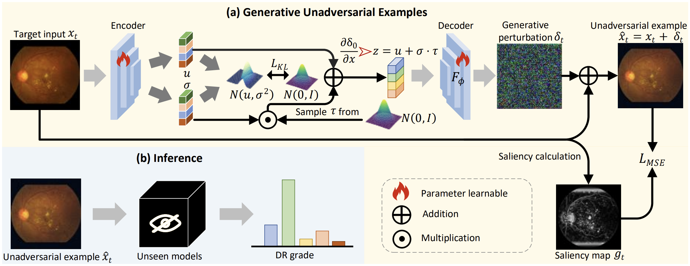

# 💭 Domain Adaptive Diabetic Retinopathy Grading with Model Absence and Flowing Data

<p align="center"></p>

This repository was developed by [Wenxin Su](https://hazelsu.github.io/). If you encounter any issues or have questions, please don't hesitate to contact Wenxin at suwenxin43@gmail.com. It is also the official repository for [**CVPR'25**] [Domain Adaptive Diabetic Retinopathy Grading with Model Absence and Flowing Data (GUES)](https://arxiv.org/pdf/2412.01203)

## Preliminary

To use the repository, we provide a conda environment.
```bash
conda update conda
conda env create -f environment.yml
conda activate gues
```

### Data Preparation

1\. Download each dataset as follows:
- APTOS 2019 [[homepage](https://www.kaggle.com/c/aptos2019-blindness-detection/overview)].
- DDR [[homepage](https://github.com/nkicsl/DDR-dataset)].
- DeepDR [[homepage](https://github.com/deepdrdoc/DeepDRiD)]
- Messidor-2 [[images](https://www.adcis.net/en/third-party/messidor2/)] [[labels](https://www.kaggle.com/datasets/google-brain/messidor2-dr-grades)].

You need to download the above datasets, modify the path of images in each '.txt' under the folder './data/Dr'. 
```bash
├── data
    ├── Dr
        ├── aptos_list.txt
        ├── ddr_list.txt
        ├── deepdr_list.txt
        ├── messidor_2_list.txt
```
You can also follow [this project](https://github.com/chehx/DGDR/blob/main/GDRBench/README.md#deepdr) to prepare your datasets.

2\. Generate saliency maps for each dataset.
```shell
python saliency_detect_512.py -n 8 --image-folder <path/to/processed/dataset> --output-folder <path/to/saliency/folder>
```

### Prepare DeiT-trained Model
You need to download the ImageNet pretrained transformer model : [DeiT-Base](https://dl.fbaipublicfiles.com/deit/deit_base_distilled_patch16_224-df68dfff.pth) and move them to the `./data/pretrainModel` directory.

## Training

### Source model 
- There is an example to training a source model :
```bash
python train.py
```
You can modify the `${DATASETS.ROOT_TRAIN_DIR}` and `${DATASETS.ROOT_TEST_DIR}` paths in `./configs/pretrain.yml` to change the training datasets.

- We also provide the pre-trained source models which can be downloaded from [here](https://drive.google.com/drive/folders/1NHH-CNJXqtYwFTEaE0877xLMaj1VrnDF?usp=sharing).

### Adaptation
After obtaining the source models, train a VAE model for data adaptation :

```bash
python train_gues.py
```

You can modify the `${MODEL.PRETRAIN_PATH}` in `./configs/uda.yml` to change the source model. Additionally, you can modify `${DATASETS.ROOT_TRAIN_DIR}`, `${DATASETS.ROOT_TRAIN_DIR2}` and `${DATASETS.ROOT_TEST_DIR}` in `./configs/uda.yml` to change the target domain.

## Acknowledgements
+ SSiT [official](https://github.com/YijinHuang/SSiT/tree/master)
+ GDRNet [official](https://github.com/chehx/DGDR/tree/main)
+ CDTrans [official](https://github.com/CDTrans/CDTrans)
